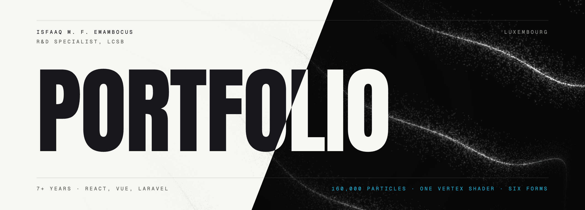

<p align="center">
  
</p>

# Portfolio

A single-page, scroll-driven portfolio. One particle field of 80,000 points takes a different form
for each section of the page, so a single element appears to evolve the whole way down rather than
each section animating on its own.

Built with react-three-fiber, a hand-written GLSL shader, GSAP and Lenis.

## How the morph works

The interesting part is what *doesn't* happen. The particles are never re-created, never re-sorted,
and their positions are never recalculated on the CPU while you scroll.

Every form the field can take is generated once at startup and packed into a single floating-point
`DataTexture`, each form occupying its own tile. Scroll position is resolved to a fractional layout
index, and the vertex shader fetches the two tiles either side of it and mixes:

```glsl
float i0 = floor(uMorph);
float t  = smoothstep(0.0, 1.0, uMorph - i0);

vec3 p = mix(sampleLayout(i0), sampleLayout(i1), t);
```

The tiling matters more than it looks. The obvious packing is one row per form, but that makes the
texture `COUNT` texels wide, and 80,000 is well past the 16,384 `MAX_TEXTURE_SIZE` most GPUs report.
The upload fails silently, every fetch returns zero, and the entire field collapses onto the origin.
So forms are tiled 256 texels wide and stacked instead, and the shader reconstructs the coordinate:

```glsl
vec3 sampleLayout(float layer) {
  float col = mod(aIndex, uTexW);
  float row = floor(aIndex / uTexW);
  return texture2D(uLayouts, vec2(
    (col + 0.5) / uTexW,
    (layer * uTileH + row + 0.5) / (uLayoutRows * uTileH)
  )).xyz;
}
```

Three consequences worth the trouble:

- **Scrolling costs no per-frame CPU work.** No loop over 80,000 positions, no buffer re-upload.
  The only thing that changes between frames is one float uniform.
- **Adding a section costs one tile.** Layouts are plain functions returning a `Float32Array`, so a
  new form is a new function in a list.
- **Particles arc instead of sliding.** A `sin(t * PI)` swell peaks at mid-transition and drives the
  points through curl-style flow noise, so they bloom outward and reconverge. This is the single
  detail that separates a morph that looks alive from one that looks like a tween.

Forms are generated from a seeded PRNG, so they are art-directed rather than incidental: the same
structure appears on every load. Each one also carries its own offset, opacity and pointer strength,
interpolated on the same morph value, so the field steps aside for the type in the hero, drops right
back in the reading-heavy sections, and opens around the cursor where there is room for it.

## The forms are the content

Three of the six layouts derive their shape from the site's own data, so the visual reshapes itself
when the content changes rather than needing to be retuned by hand.

| Section | Form | Driven by |
| --- | --- | --- |
| Hero | Bonded molecular structure | Procedural random walk |
| Profile | Wide cloud with depth | Procedural |
| Experience | Horizontal strata, one band per role, newer roles higher and wider | `ROLES` |
| Toolkit | Clusters with a halo of strays | `SKILL_CLUSTERS` |
| Work | Discrete clumps behind the cards | `PROJECTS` |
| Contact | Collapses back to the hero structure | Reuses the hero generator |

## Stack

| | |
| --- | --- |
| Build | Vite, React 19, TypeScript |
| 3D | react-three-fiber, three, custom GLSL, bloom in dark mode |
| Motion | GSAP with ScrollTrigger and SplitText, Lenis |
| Styling | Tailwind v4 |
| Type | Anton, Geist, Geist Mono, self-hosted |

## Running it

```bash
npm install
npm run dev
```

```bash
npm run build      # typecheck, then production build
npm run typecheck
```

## Structure

```
src/
  content.ts              all copy and CV data in one place
  scroll.ts               the only scroll listener in the app
  pointer.ts              the only pointer listener in the app
  theme.ts                light and dark, shared by the DOM and the canvas
  Scene.tsx               canvas, camera drift, bloom
  Scrollbar.tsx           the floating scrollbar, drawn rather than styled
  particles/
    layouts.ts            the six forms
    shaders.ts            the morph
    rng.ts                seeded generator, so the field is reproducible
    ParticleField.tsx     packs layouts into the texture, drives the uniform
  sections/               one component per section
```

Two conventions hold this together:

**One source of scroll truth.** `scroll.ts` is the only module in the app listening to scroll.
Everything animated reads from the object it exports. Independent scroll listeners are what make
scroll-driven sites desync and feel broken.

**Section order is layout order.** Sections register themselves on mount, `scroll.ts` measures their
offsets, and the fractional layout index comes from whichever section the viewport centre is in. A
form therefore stays settled while you read its section instead of drifting continuously down the
page. `LAYOUTS` and the section list in `App.tsx` must stay in step.

## Performance

three and the postprocessing chain are most of the bundle, so the scene is behind `React.lazy` and
the text never waits on it.

| Chunk | Gzipped |
| --- | --- |
| Initial (React, GSAP, Lenis, content) | 120 kB |
| Scene (three, postprocessing) | 254 kB |

`dpr` is capped at 1.75 and antialiasing is off. The particles are soft-edged in the fragment shader
rather than by the hardware, so there are no hard edges for it to smooth.

## Light and dark

The site opens dark and remembers what you pick from the toggle in the hero. Both themes are
off-white and off-black rather than pure, and the particle field takes the same neutral as the body
text in each: dark on light, off-white on dark.

It is not a palette swap. The field is drawn with additive blending, which only ever brightens, so
on a light page it would be invisible. Light mode switches the material to normal blending, turns
bloom off, lifts the alpha to compensate, and flips the mid-transition flare to deepen rather than
glow. The two themes are the same field rendered two different ways.

Switching between them crossfades rather than snaps. The page colours interpolate, gradients
included, and the field dips briefly and comes back, which is what covers the blending change
underneath. Both are skipped if you prefer reduced motion.

## Reduced motion

`prefers-reduced-motion` gets a genuinely different build rather than the animated site with the
motion switched off, which tends to leave content stranded at `opacity: 0`:

- Lenis is skipped for native scroll, and the morph snaps instead of easing
- Turbulence goes to zero and the particle count drops to 22,000
- The Experience section renders as a plain stacked list instead of a sticky stepper
- The cursor no longer perturbs the field, and the camera stops drifting

All content lives in the DOM in reading order regardless of scroll state, there is a skip link, and
the focus ring is visible.

## Licence

Code is MIT. The written content, CV data and the likeness are mine, please don't reuse those.
